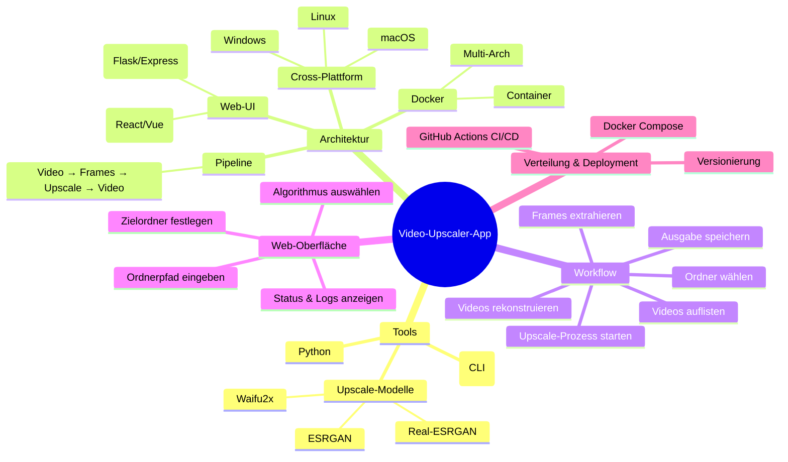

### Mindmap Übersicht

### Schritte zur Umsetzung

1. **Projektsetup**  
   - Git-Repository & VS Code-Workspace  
   - Dockerfile mit Multi-Stage Build  
2. **CLI-Pipeline entwickeln**  
   - Python-Skripte (ffmpeg-python, imageio)  
   - Integration des Upscale-Modells (PyTorch/TensorFlow)  
3. **Web-Interface umsetzen**  
   - Backend: Flask/Express + REST-API  
   - Frontend: React/Vue + File Picker  
   - Task-Queue (Celery/RQ) für asynchrone Verarbeitung  
4. **Containerisierung & Cross-Platform**  
   - Multi-Arch Docker-Image (linux/amd64, arm64)  
   - Lokale Virtualenvs für Windows/macOS  
5. **Deployment & Distribution**  
   - Docker Hub Release  
   - GitHub Actions Pipeline  
   - Automatisierte Tests & Linter  

